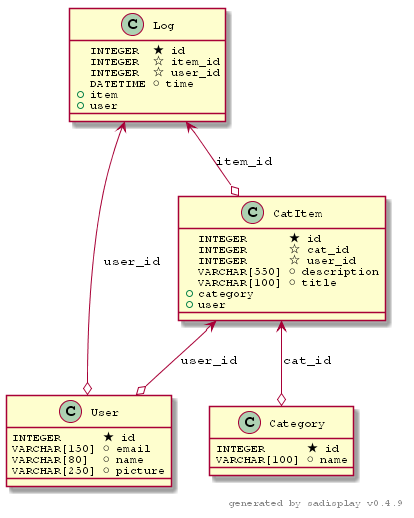

# project catalog for sport items
## description 
this is a website shows sports catagories with main equipment reqierd for sport and some details about it
and the ability to edit/add items

* check new changes at [changes.md](changes.md)


# database

## tables
### log 

    log new created items

### user

    hold user name and mail for authontication

### catagory

    contains catagory name and id

### carItem

    * contains item name and id

    * linked to user how create it

    * linked to it's catagory


# site pages

## homepage 
[localhost:5000](http://localhost:5000/)
* don't use __0.0.0.0:5000__ for google aouth2 to work

## json end point :
---
### [Full catalog in json](http://localhost:5000/catalog/json)

    return json of all catagories and items

    link:`/catalog/json`
```json
{
  "cataoeries": [
    {
      "id": 1, 
      "name": "Basketball", 
      "Items": [
        {
          "title": "Basketball ball ", 
          "description": "A basketball is a spherical ball used in basketball games. Basketballs typically range in size from very small promotional items only a few inches in diameter to extra large balls nearly a foot in diameter used in training exercises. For example, a youth basketball could be 27 inches (69 cm) in circumference, while a National Collegiate Athletic Association (NCAA) men's ball would be a maximum of 30 inches (76 cm) and an NCAA women's ball would be a maximum of 29 inches (74 cm)", 
          "id": 1
        }
      ]
    },  
    // so on
    // ...
    // ...
    // ...
    // .
    // .
    // .
    // .
    // .
    // .
    // .
    // .
    // .
    // .    
  ]
}
```

-----------
### [availble catagries](http://localhost:5000/category/json)
    
    return json of all catagories
    
    link: `/category/json`

```json
{
  "categories_items": [
    {
      "id": 1, 
      "name": "Basketball"
    }, 
    {
      "id": 2, 
      "name": "Volleyball"
    }, 
    {
      "id": 3, 
      "name": "hockey"
    }
  ]
}
```
---
### [items in specifc catagory by id](http://localhost:5000/category/1/items/json)
    
    return json of items in catagory by id
    
    link: `/category/<int:category_id>/items/json`

```json
{
  "categories_items": [
    {
      "title": "Basketball ball ", 
      "description": "A basketball is a spherical ball used in basketball games. Basketballs typically range in size from very small promotional items only a few inches in diameter to extra large balls nearly a foot in diameter used in training exercises. For example, a youth basketball could be 27 inches (69 cm) in circumference, while a National Collegiate Athletic Association (NCAA) men's ball would be a maximum of 30 inches (76 cm) and an NCAA women's ball would be a maximum of 29 inches (74 cm)", 
      "id": 1
    }, 
    {
      "title": "Ring", 
      "description": "A backboard is a piece of basketball equipment. It is a raised vertical board with an attached basket consisting of a net suspended from a hoop. It is made of a flat, rigid piece of, often Plexiglas or tempered glass which also has the properties of safety glass when accidentally shattered. It is usually rectangular as used in NBA, NCAA and international basketball. In recreational environments, a backboard may be oval or a fan-shape, particularly in non-professional games.", 
      "id": 2
    }
  ]
}
```
-------
### [item detail](http://localhost:5000/category/1/item/1/json)

    return json of item by id

    link:`/category/<int:category_id>/item/<int:catItem_id>/json`

```json
{
  "item": {
    "title": "Basketball ball ", 
    "description": "A basketball is a spherical ball used in basketball games. Basketballs typically range in size from very small promotional items only a few inches in diameter to extra large balls nearly a foot in diameter used in training exercises. For example, a youth basketball could be 27 inches (69 cm) in circumference, while a National Collegiate Athletic Association (NCAA) men's ball would be a maximum of 30 inches (76 cm) and an NCAA women's ball would be a maximum of 29 inches (74 cm)", 
    "id": 1
  }
}
```


# list site pages
* [home](http://localhost:5000/catalog/json)

* [items in first catagory ](http://localhost:5000/catalog/Basketball/items)

    > catalog/Basketball/items


* [item detail ](http://localhost:5000/catalog/Basketball/Basketball%20ball%20)

    > catalog/Basketball/Basketball%20ball%20

* [login page](http://localhost:5000/login)


## user pages
* add: [(catalog/Basketball/add)](http://localhost:5000/catalog/Basketball/add)

* edit: http://localhost:5000/catalog/\<item name\>/edit

* delete: http://localhost:5000/catalog/\<item name\>/edit


# running project
## prereqirment 

> python interpeter: python3.7

### main pakages you may user /requirment.txt
> SQLAlchemy==1.3.3

> Flask==1.0.2

> httplib2==0.12.1

> oauth2client==4.1.3
* for uml diagram (optional)
> sadisplay==0.4.9

## create database and fill some data(optional *use catalog.db)
> ```python3.7 db_setup.py``` 

> ```python3.7 data.py```

## start server
> ```python3.7 application.py```
